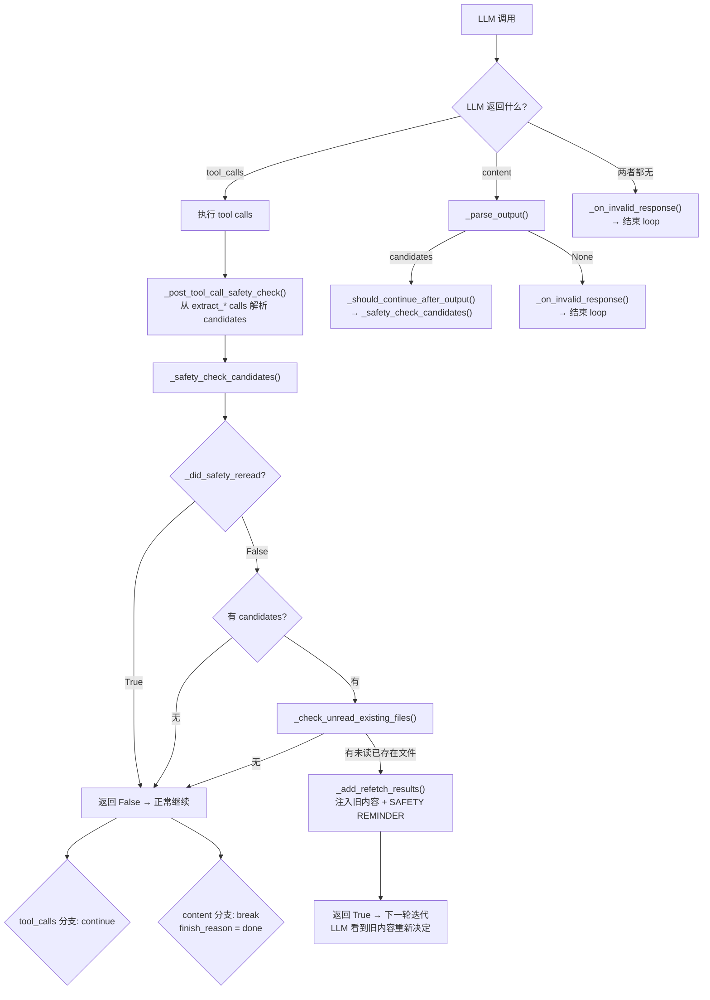

# ReactLoop Safety Check Mechanism

## Problem

In lazy mode extraction, the "read before write" safety check (`_check_unread_existing_files`) only triggered when the LLM returned JSON **content** and went through `_should_continue_after_output()`. But when the LLM used **extract_* tool calls** to produce candidates, those candidates were collected directly from `tools_used` in `_to_extraction_react_result()` — bypassing the safety check entirely. This meant upsert-type memories (e.g. preference) could be overwritten without the LLM ever reading the existing content.

## Solution

Three hooks added to [[ogmemory-react-loop-abstract-base-class]] base class, with `ExtractionReActLoop` overriding them:

### 1. `_post_tool_call_safety_check()` — unify safety check for both paths

Called after all tool calls in the current round are executed. Extraction subclass overrides it to:
- Parse extract_* tool calls from the current round into `CandidateMemory`
- Delegate to `_safety_check_candidates()` (shared logic)

The content-output path (`_should_continue_after_output`) also delegates to `_safety_check_candidates()` via:
```python
candidates = [c for c in parsed if isinstance(c, CandidateMemory)]
return self._safety_check_candidates(candidates, messages, ctx, iter_trace)
```

Both paths now share the same unread-existing-files check and refetch logic.

### 2. `_safety_check_candidates()` — unified check logic

Extracted from the old `_should_continue_after_output` body. Core logic:
1. If `_did_safety_reread` is already True → skip (one-time guard)
2. If no candidates → skip
3. For each candidate: skip add-only schemas, skip already-read URIs, skip non-existing files
4. If unread existing files found → `_add_refetch_results()` (inject read results + SAFETY REMINDER into messages) → return True
5. Otherwise → return False

### 3. `_on_invalid_response()` — end loop on invalid response (not disable tools)

When LLM produces unparseable content or no output at all, the old behavior was to disable tools and continue iterating. In extraction this is pointless — without tools the LLM cannot `read` context or call `extract_*`, so it can never produce valid candidates.

- **Base class default**: `disable_tools = True`, return `False` (continue iterating)
- **Extraction override**: log warning, return `True` (end loop immediately, `finish_reason = "no_valid_output"`)

## Flow Diagram



## Key Files

- `core/react_loop.py` — base class with `_post_tool_call_safety_check()`, `_on_invalid_response()`, `_should_continue_after_output()`
- `extraction/extraction_react_loop.py` — overrides with `_safety_check_candidates()`, extraction-specific `_on_invalid_response()`
- `tests/unit/extraction/test_react_loop.py` — updated tests for early loop termination

## Related

- [[ogmemory-react-loop-abstract-base-class]] — base class template method design
- [[oG-Memory Extraction Pipeline Modes]] — lazy/eager mode architecture