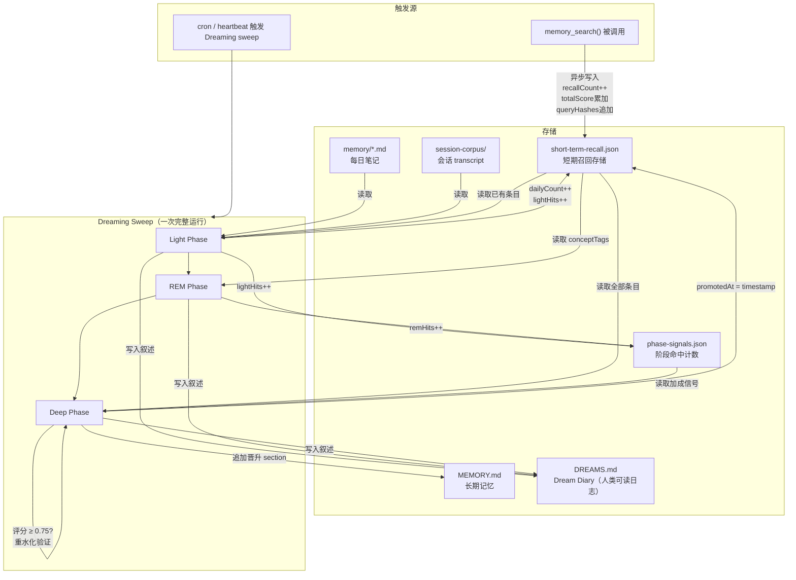
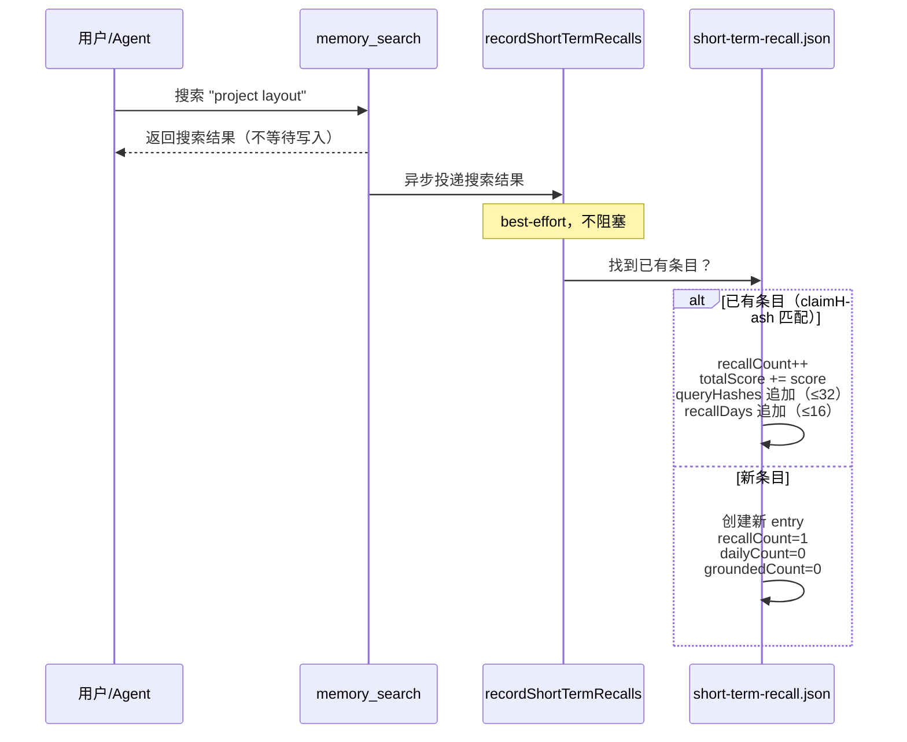
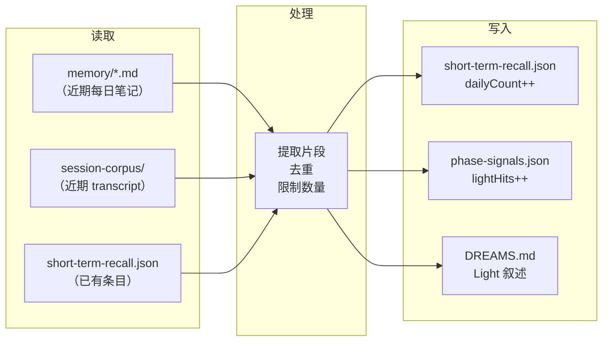
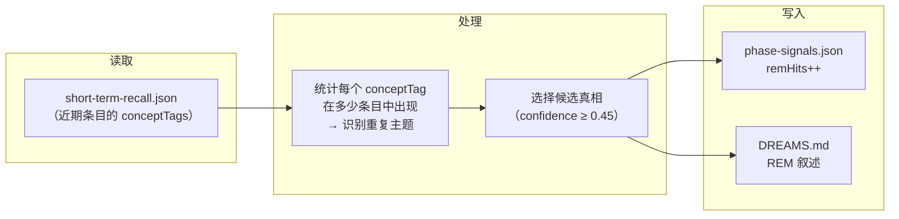
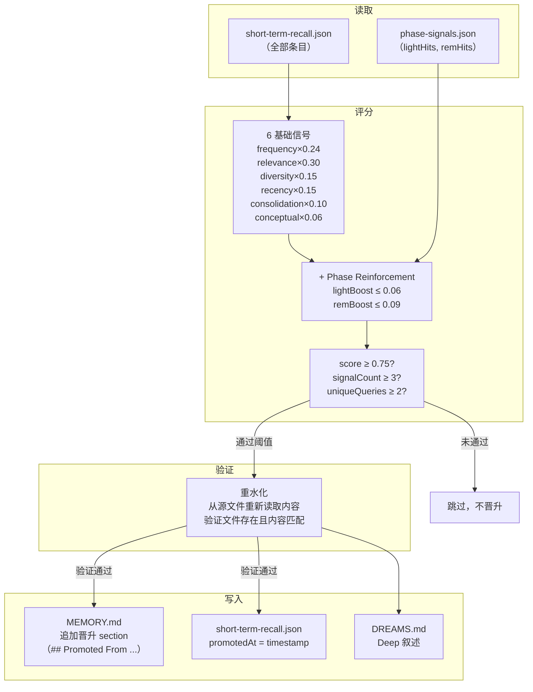

# Dreaming 机制可视化数据流

本文是对 [[OpenClaw Dreaming Mechanism]] 的可视化补充，用 Mermaid 图逐阶段展示每个过程的读写操作。核心思路：Dreaming 就是一个 **"短期信号 → 评分筛选 → 长期存储"** 的管道，每个阶段只做一两件事，读写的文件都不同。

---

## 总体数据流

---

## 阶段零：信号收集（随时发生，不属于 Sweep）

**读**：无（搜索本身读的是 SQLite 索引，这里只关心搜索结果的后处理）

**写**：`short-term-recall.json`
- `recallCount++`
- `totalScore` 累加本次分数
- `queryHashes` 追加查询哈希（FIFO，上限 32）
- `recallDays` 追加当天日期（FIFO，上限 16）

---

## 阶段一：Light Phase（收集 + 暂存）

**目的**：把分散在每日笔记和会话记录里的短期信号汇聚到统一的召回存储中。

**读**：
- `memory/*.md`（近期每日笔记文件）
- `session-corpus/*.txt`（近期会话 transcript）
- `short-term-recall.json`（检查已有条目，避免重复创建）

**写**：
- `short-term-recall.json`：匹配到的条目 `dailyCount++`；新发现的条目创建并设置 `dailyCount=1`
- `phase-signals.json`：每个处理过的条目 `lightHits++`
- `DREAMS.md`：追加 Light Phase 的叙述性日记

**不写**：MEMORY.md、recallCount

---

## 阶段二：REM Phase（反思主题）

**目的**：识别跨条目反复出现的概念主题，为 Deep Phase 评分提供额外信号。

**读**：`short-term-recall.json`（只看近期条目的 `conceptTags` 字段）

**写**：
- `phase-signals.json`：匹配到的条目 `remHits++`
- `DREAMS.md`：追加 REM Phase 的叙述性日记

**不写**：MEMORY.md、short-term-recall.json、recallCount、dailyCount

---

## 阶段三：Deep Phase（评分 + 晋升）

唯一写入 MEMORY.md 的阶段。

**读**：
- `short-term-recall.json`（全部条目的信号数据）
- `phase-signals.json`（lightHits 和 remHits 作为加成）
- `memory/*.md`（重水化：从源文件验证候选内容是否仍然存在）

**写**：
- `MEMORY.md`：追加 `## Promoted From Short-Term Memory (date)` section，每条晋升内容带 HTML 注释标记用于去重
- `short-term-recall.json`：已晋升条目设置 `promotedAt = timestamp`（不删除，只是标记）
- `DREAMS.md`：追加 Deep Phase 的叙述性日记

---

## 文件读写总结

| 文件 | 谁读 | 谁写 | 写入内容 |
|------|------|------|----------|
| `short-term-recall.json` | Light/REM/Deep 全阶段 | memory_search 后处理、Light、Deep | recallCount/dailyCount/groundedCount、promotedAt |
| `phase-signals.json` | Deep（读加成） | Light（lightHits++）、REM（remHits++） | 各阶段命中计数 |
| `MEMORY.md` | Bootstrap、搜索索引、memory_get | Deep（追加）、Agent 手动编辑 | 晋升的长期记忆 |
| `DREAMS.md` | 无人（纯人类审查） | Light/REM/Deep | 各阶段叙述性日记 |
| `memory/*.md` | Light（收集信号）、Deep（重水化验证） | Agent（正常编辑）、Flush（保存重要内容） | 每日笔记 |
| `session-corpus/` | Light（收集信号） | 会话系统 | 会话 transcript |

一句话总结：**`.dreams/` 里的两个 JSON 文件是 Dreaming 的"工作台"——所有阶段都往里面记数，只有 Deep Phase 的最后一步才会把得分最高的条目"毕业"到 MEMORY.md。** DREAMS.md 只是副产品日志，给人类看的，不影响任何自动化流程。
