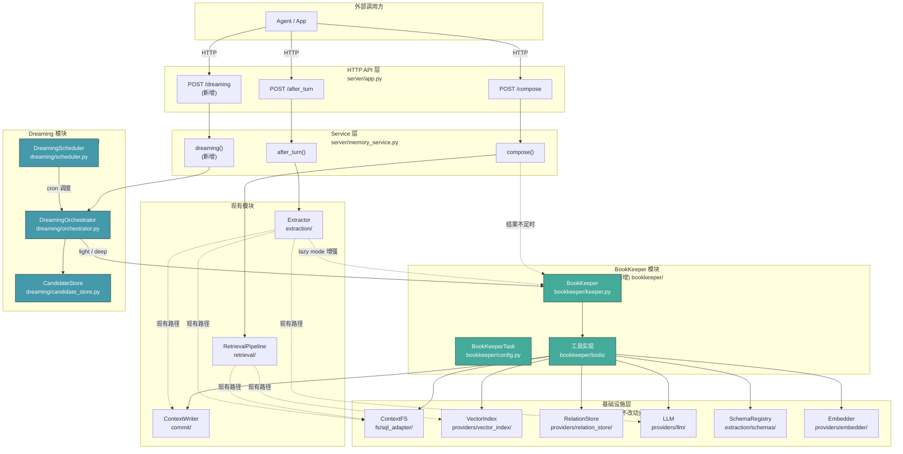
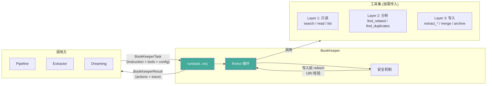
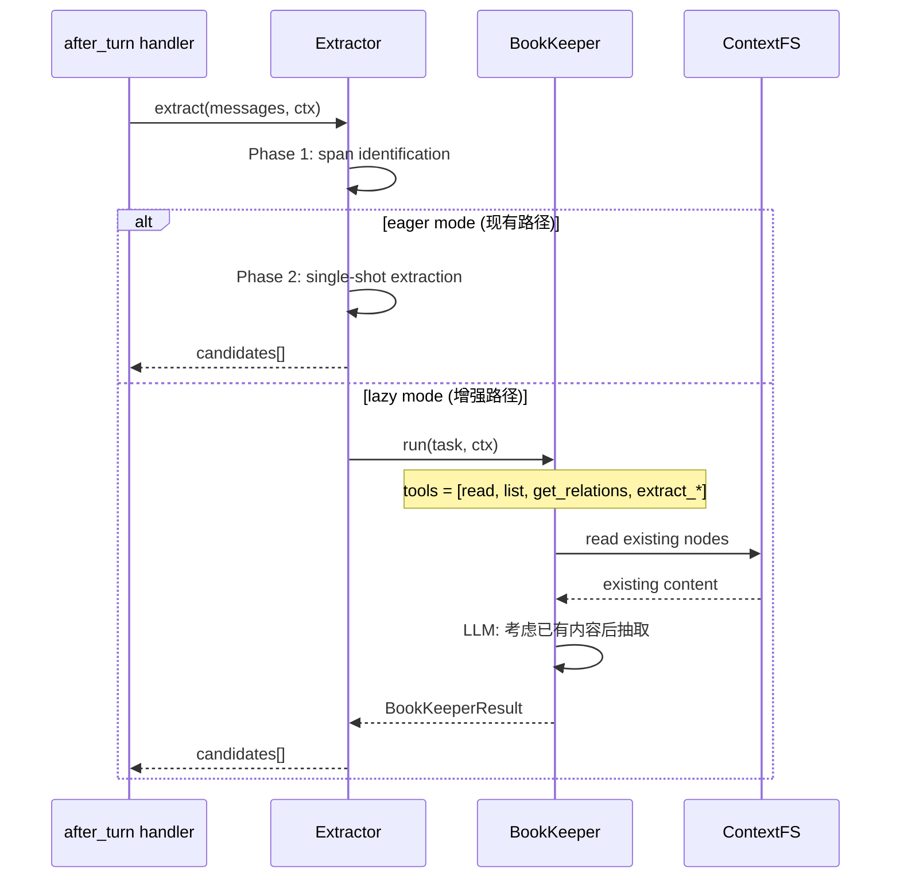
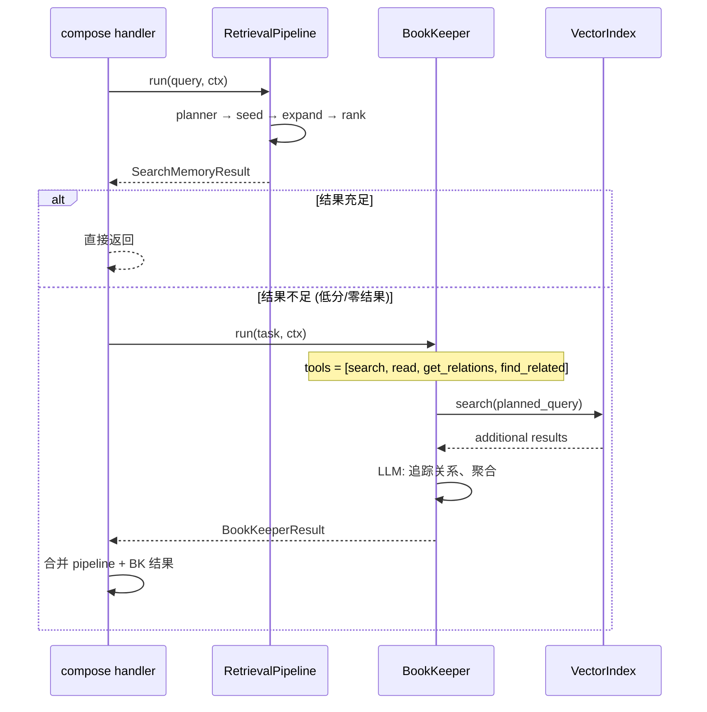
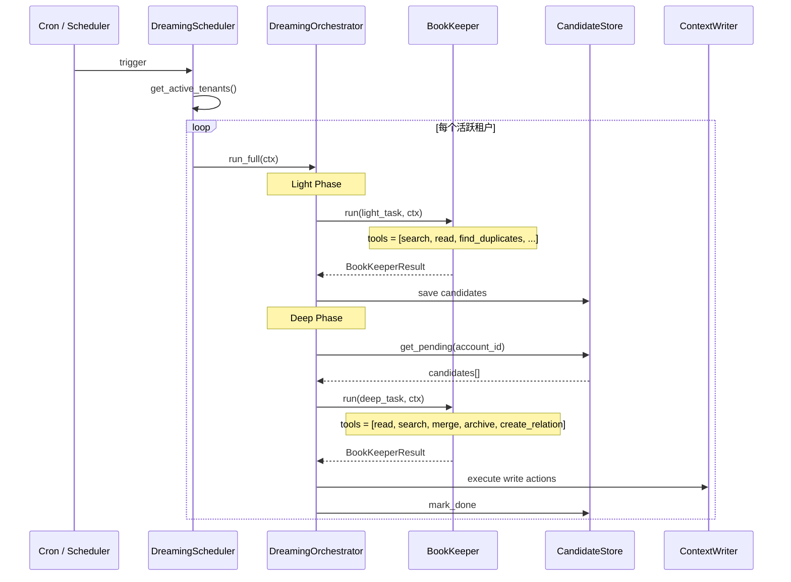

# BookKeeper RFC v2

> **文档目的**：面向团队开发者的设计讨论稿。聚焦"做什么、为什么、和现有模块什么关系"。
>
> 前一版 RFC（[[oG-Memory BookKeeper Design RFC]]）包含完整的背景调研和技术细节，本文是其精简重写。

---

## 1. 背景

### 我们有什么

oG-Memory 目前的记忆管理能力：

| 能力 | 实现 | 局限 |
|------|------|------|
| **抽取** | `Extractor` 两阶段（span identification → span structuring） | eager mode 单次抽取，遇到冲突只能靠 schema 规则合并 |
| **检索** | `RetrievalPipeline` 四阶段（planner → seed → expand → rank） | 纯规则 pipeline，不理解用户上下文，复杂查询力不从心 |
| **后台维护** | 无 | 记忆只增不减：重复堆积、过期不清理、关系不主动发现 |

共同问题：这些操作都是**单次、无反馈**的。没有"看一看结果，决定下一步怎么做"的能力。

### 我们需要什么

一个 **LLM-in-the-loop 执行引擎**，能够：

1. **多步检索**：pipeline 结果不足时，基于已有结果追问、沿关系追踪、聚合多源信息
2. **智能抽取**：遇到与已有记忆冲突时，读取已有内容再做合并决策；对低价值信息主动跳过
3. **后台整理**（Dreaming）：定期扫描记忆库，发现重复、过期、可聚合的模式，执行清理

这三件事的核心模式相同：LLM 思考 → 调用工具观察 → 再思考 → 再调用 → 最终产出。即 ReAct 循环。

### 领域趋势

2026 年 Agentic Memory 领域的研究表明，记忆管理正从"被动存储"转向"主动推理驱动"。代表性工作：

- **MIA**（[arXiv:2604.04503](https://arxiv.org/abs/2604.04503)）：Planner-Executor 架构，先规划搜索策略再执行
- **LongSeeker**（[arXiv:2605.05191](https://arxiv.org/abs/2605.05191)）：五种记忆操作原语（Skip / Compress / Rollback / Snippet / Delete），证明有限原语集可表达完备的记忆管理能力
- **MemReader**（[arXiv:2604.07877](https://arxiv.org/abs/2604.07877)）：显式的信息价值评估——区分"值得存储"、"等待更多上下文"、"直接丢弃"
- **HiGMem**（[arXiv:2604.18349](https://arxiv.org/abs/2604.18349)）：用摘要层做锚点定位，再精准读取完整内容，减少无效读取

---

## 2. 定位

### BookKeeper 是什么

**BookKeeper** = oG-Memory 内部的 ReAct 执行引擎。

它是一个"图书管理员"——收到一个任务描述和一组工具，就在记忆库里执行多轮搜索、分析、读写操作，最终返回结构化的操作结果。

```
BookKeeper 的核心循环：

  Instruction + Tools + Context
          ↓
  ┌─────────────────────────┐
  │  LLM 思考               │
  │  "我应该先看看这个用户   │
  │   的 profile..."        │
  └────────┬────────────────┘
           ↓
  ┌─────────────────────────┐
  │  调用工具               │
  │  read(ctx://.../profile) │
  └────────┬────────────────┘
           ↓
  ┌─────────────────────────┐
  │  观察结果               │
  │  "这个用户偏好..."      │
  └────────┬────────────────┘
           ↓
  ┌─────────────────────────┐
  │  LLM 再思考             │
  │  "基于这个偏好，我应该  │
  │   搜索..."              │
  └────────┬────────────────┘
           ↓
         ...（重复直到产出最终结果）
```

### BookKeeper 不是什么

- **不是外部 API**：不暴露给 oG-Memory 的调用方（agent / 应用），只被 oG-Memory 内部模块使用
- **不是全局常驻服务**：按需创建、用完即弃，每次运行绑定一个 `RequestContext`
- **不是框架**：不追求通用 ReAct 能力（不搞 langchain），只服务记忆管理场景
- **不做调度**：不决定"什么时候整理记忆"——这是 Dreaming 编排层的职责

### 在 oG-Memory 服务中的位置

```
┌─────────────────────────────────────────────────────────────────┐
│                        oG-Memory Service                        │
│                                                                 │
│  External APIs (agent/app 调用)                                  │
│  ┌────────────┐  ┌────────────┐  ┌────────────┐                │
│  │  /compose  │  │ /after_turn│  │ /dreaming  │  (新增)         │
│  └─────┬──────┘  └─────┬──────┘  └─────┬──────┘                │
│        │               │               │                        │
│        ▼               ▼               ▼                        │
│  ┌───────────────────────────────────────────────────┐          │
│  │              Service 层 (memory_service.py)        │          │
│  │                                                    │          │
│  │   compose()        after_turn()     dreaming()     │          │
│  │       │                 │               │          │          │
│  │       ▼                 ▼               ▼          │          │
│  │  ┌──────────┐  ┌──────────────┐  ┌────────────┐   │          │
│  │  │ Pipeline │  │  Extractor   │  │ Dreaming   │   │          │
│  │  │ (现有)   │  │  (现有)      │  │ (新增模块) │   │          │
│  │  └────┬─────┘  └──────┬───────┘  └─────┬──────┘   │          │
│  │       │               │                │          │          │
│  │       └───────────────┼────────────────┘          │          │
│  │                       ▼                           │          │
│  │              ┌─────────────────┐                  │          │
│  │              │   BookKeeper    │  ← 本 RFC 核心   │          │
│  │              │  (新增模块)     │                  │          │
│  │              └────────┬────────┘                  │          │
│  │                       │ 调用                      │          │
│  └───────────────────────┼───────────────────────────┘          │
│                          ▼                                      │
│  ┌───────────────────────────────────────────────────┐          │
│  │               现有基础设施                          │          │
│  │  ContextFS │ VectorIndex │ RelationStore │ LLM     │          │
│  │  ContextWriter │ Embedder │ SchemaRegistry │ ...   │          │
│  └───────────────────────────────────────────────────┘          │
└─────────────────────────────────────────────────────────────────┘
```

### 多租户

BookKeeper 每次 `run()` 接收一个 `RequestContext`，天然继承现有 RLS 隔离。它不会跨租户操作，也不需要额外的隔离机制。

> **Open to discuss**: 团队级记忆整理（跨 `owner_space`）需要 `visible_owner_spaces` 配置。目前 oG-Memory 的团队功能边界还不清晰，BookKeeper 暂时只处理单 `owner_space` 的场景。团队级 Dreaming 作为后续扩展点。

### 权限模型

BookKeeper 的权限 = 调用方传入的工具集。传什么工具，它就只能做什么。

已确定的场景：

| 调用方 | 可用工具 | 效果 |
|--------|---------|------|
| Pipeline（检索） | 只读 + 分析 | 只能搜索和读取，不能写入 |
| Extractor（抽取） | 只读 + extract_* + update | 只能抽取新记忆或合并更新已有记忆 |

> **Open to discuss: Dreaming 与 BookKeeper 的关系**
>
> 前一版 RFC 将 Dreaming 设计为"编排层调用 BookKeeper"——Dreaming Orchestrator 决定做什么，BookKeeper 负责怎么做。但这个关系还需要讨论，因为有几个待厘清的问题：
>
> **问题 1：Dreaming 的核心能力应该在哪？**
>
> Dreaming 需要做的事——发现重复、检测过期、聚合 event 为 pattern、建立关系——这些是 BookKeeper 通过工具组合完成的，还是 Dreaming 模块自有的独立能力？
>
> - **方案 A：Dreaming 是编排层，BookKeeper 是执行引擎**。Dreaming 只做调度（"扫描这个租户近 7 天的记忆"），实际的分析和写入由 BookKeeper 的多轮 ReAct 完成。优点是 BookKeeper 保持通用、可复用；缺点是 Dreaming 的每次操作都要经过完整的 LLM 循环，成本较高。
> - **方案 B：Dreaming 有自己的核心逻辑，BookKeeper 作为工具**。Dreaming 模块内含专门的扫描/聚合/合并算法（部分规则化、不需要 LLM），只在需要语义判断时调用 BookKeeper 作为工具。优点是简单操作（如按 category 查重复）不需要走 LLM，成本低；缺点是 Dreaming 和 BookKeeper 职责有重叠。
> - **方案 C：BookKeeper 内置 Dreaming 工具**。`scan_duplicates(category)`、`aggregate_events(time_range)` 等作为 BookKeeper 的分析层工具，Dreaming 编排层只需配置"用这些工具跑一轮"即可。介于 A 和 B 之间。
>
> **问题 2：谁来触发 Dreaming？**
>
> - 定时 cron（简单，但可能扫描到不需要整理的租户）
> - 事件驱动（如"记忆数超过 N 条"时触发，更精准）
> - BookKeeper 在抽取/检索过程中发现问题，主动建议触发 Dreaming（如"这个用户的 preference 节点有 20 条，可能有重复"）
>
> **问题 3：Dreaming 的输出如何落地？**
>
> - 自动执行（Dreaming 产出的操作直接写入）
> - 半自动（产出候选 → 持久化 → 人工确认或自动确认后执行）
> - 作为建议返回给调用方（由 API handler 决定）
>
> 这些问题需要与负责 Dreaming 模块的同事一起讨论确定。当前的模块架构图（3.1）按方案 A 绘制，后续讨论后可能需要调整。

---

## 3. 模块架构

### 3.1 整体模块关系

下图展示了 BookKeeper 与 oG-Memory 现有模块的关系。每个框代表一个 Python 模块/类，箭头表示调用方向。



**虚线箭头** = 新增的调用路径（BookKeeper 增强现有模块的能力）。**实线箭头** = 现有调用路径不变。

### 3.2 BookKeeper 内部结构



**调用方只需关心两件事**：

1. **传入什么**：`BookKeeperTask`（任务指令 + 工具集 + 配置）
2. **拿回什么**：`BookKeeperResult`（LLM 产出的操作列表 + 追踪日志）

### 3.3 与现有模块的交互细节

#### 与 Extraction 模块（extraction/）



**改动点**：`ExtractionReActLoop` 内部委托给 BookKeeper。外部接口不变。

#### 与 Retrieval 模块（retrieval/）



**改动点**：`compose()` 中增加 fallback 判断逻辑。Pipeline 本身不改动。

> **Open to discuss**: 触发 BookKeeper 的条件。候选方案：(a) pipeline 返回 0 结果，(b) 最高 score 低于阈值，(c) 调用方显式请求 `mode=deep`。初期建议先用 (a) + (b)，避免增加 API 复杂度。

#### 与 Dreaming 模块（dreaming/，新增）



**Dreaming 是编排层，BookKeeper 是执行引擎**。Dreaming 决定"做什么"（扫描哪些记忆、整理什么），BookKeeper 决定"怎么做"（多轮工具调用实现目标）。

> **Open to discuss**: Light 和 Deep 是否在同一次运行中执行，还是 Light 每小时、Deep 每天分开调度。初期建议合并在一次运行中简化实现，后续再拆分。
>
> **Open to discuss**: Dreaming 的 HTTP API 是否需要暴露给外部。初期建议只支持内部 cron 触发，不暴露 API。

### 3.4 工具与基础设施的映射

BookKeeper 的工具实现复用现有基础设施，不引入新的依赖：

| 工具 | 实现位置 | 调用的 Protocol |
|------|---------|----------------|
| `search(query, filters)` | bookkeeper/tools/search.py | `Embedder.embed_texts` + `VectorIndex.search_by_vector` |
| `read(uri)` | bookkeeper/tools/read.py | `ContextFS.read_node` |
| `list(uri)` | bookkeeper/tools/read.py | `ContextFS.list_children` |
| `get_relations(uri)` | bookkeeper/tools/relations.py | `RelationStore.get_edges` |
| `get_access_stats(uri)` | bookkeeper/tools/stats.py | `ContextFS.read_node` → metadata |
| `extract_*(fields)` | 复用 extraction/tool_builder.py | `SchemaRegistry` + `parse_tool_call` |
| `update_node(uri, fields)` | bookkeeper/tools/write.py | `ContextWriter.write_candidate` |
| `merge_nodes(uris)` | bookkeeper/tools/write.py | `ContextFS.read_node` × N → LLM 合并 → `ContextWriter` |
| `archive_node(uri)` | bookkeeper/tools/write.py | `ContextFS.archive_node` |
| `create_relation(...)` | bookkeeper/tools/write.py | `RelationStore.upsert_edges` |
| `find_duplicates(category)` | bookkeeper/tools/analysis.py | `VectorIndex.search_by_vector` + 相似度阈值 |
| `find_related(uri, hops)` | bookkeeper/tools/analysis.py | `RelationStore.get_one_hop` 递归 |
| `compute_importance(uri)` | bookkeeper/tools/analysis.py | metadata 计算（access_count × recency × relation_count） |

### 3.5 各开发者的关注点

| 你负责的模块 | BookKeeper 对你的影响 |
|-------------|---------------------|
| **extraction/** | `ExtractionReActLoop` 内部可委托给 BookKeeper，外部接口不变。你只需在 `_structure_span_lazy` 中改用 BookKeeper 即可 |
| **retrieval/** | Pipeline 不改动。`compose()` handler 中增加一个 fallback 分支调用 BookKeeper。需要定义"结果不足"的判断条件 |
| **server/memory_service.py** | 新增 `dreaming()` 方法和 `/dreaming` API 端点。其他方法（compose、after_turn）增加 BookKeeper fallback 调用 |
| **commit/** | ContextWriter 不改动。BookKeeper 的写入工具直接调用 ContextWriter |
| **core/interfaces.py** | 不改动。BookKeeper 使用现有 Protocol |
| **dreaming/** (新模块) | 需要新建。负责编排 Light/Deep 阶段、管理候选任务持久化、调度 |
| **bookkeeper/** (新模块) | 需要新建。核心 ReAct 循环 + 工具实现 |

---

> **相关文档**
> - 前一版 RFC（含完整技术细节）：[[oG-Memory BookKeeper Design RFC]]
> - 领域调研（10 篇论文）：[[Agentic Memory ReAct Research]]
> - 现有抽取/存储分析：[[oG-Memory Extraction and Storage Analysis]]
> - OpenClaw Dreaming 参考：[[OpenClaw Dreaming Mechanism]]
