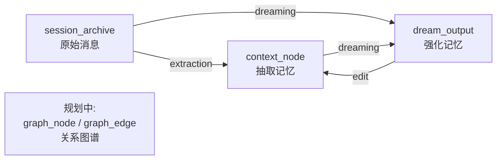

# oG-Memory Provenance Design (RFC)

> 用于开发团队对齐讨论。学术背景见 [[Memory Provenance in Agentic Systems]] 和 [[Agent Memory Provenance 追踪实现调研]]。

---

# 需求背景

记忆经历多个处理阶段——原始观测 → 压缩/抽取 → 结构化存储 / 晋升，各模块之间存在多方向的关系：



LLM 参与的环节可能产生幻觉或错误归因，涉及下述问题：

- **可信度**：用户能否验证 agent 的记忆来源？
- **可调试性**：当 agent 基于错误记忆行动时，能否定位错误源头？
- **合规性**：记忆是否包含未授权信息？
- **一致性**：当源数据更新时，如何级联失效过时的衍生记忆？

应实现一种机制，以达到：**任何一条记忆、任何一个关系，都应该能沿着链路回溯到产生它的原始来源**。

---

# 特性描述

## 1. 现状说明

### 1.1 两条并行的存储流程

after_turn 中，消息流经两条独立路径：

```
用户消息 → TopicBuffer 累积 → threshold 达到
  ↓ 
① write_api.commit_session()  // in memory_service.py:after_turn()
   → Phase 1: Span Identification (JSON-mode LLM 识别可抽取范围)
   → Phase 2: Span Structuring (tool-call 抽取)
   → CandidateMemory[] → PolicyRouter → ContextWriter
   → context_nodes 表 (结构化记忆, 向量索引)

② commit_snapshot()
   → SessionCompressor (LLM 生成 overview/abstract)
   → session_archives 表 (原始消息 JSONB, 不分块)
```

二者串行执行（①→②），数据独立，仅通过 `extraction_summary` 做去重标记。

注：① 中 `_build_incremental_extraction_state` (`memory_service.py:1928`) 将 SessionMessage 转为匿名 dict 时丢弃了 `message.id`，导致抽取侧 span 索引与 archive 侧消息索引无法对应。P0 修复中会补回。

### 1.2 关键标识符澄清

| 标识符 | 生成时机 | 格式 | 唯一性 | 可变性 |
|--------|----------|------|--------|--------|
| `session_id` | 外部传入 | 业务定义 | 账户内唯一 | 一个 session 产生多个 archive |
| `archive_id` | commit_snapshot 时 | `20260513_100000_a1b2c3` (时间戳+UUID) | 全局唯一 | 不可变（写入后不变） |
| `message_id` | buf.add() 时 | `msg_a3f8b7c1d9e2` (uuid4 hex[:12]) | buffer 内唯一 | 不可变（随消息创建固定） |

**唯一定位一条消息**：`account_id` + `session_id` + `archive_id` + `message_id`。其中 `archive_id` 是不可变锚点。

**同一 session_id 不同 archive_id 可能包含重复的 message_id**：发生在 archive 写入成功但后续步骤（抽取/索引）失败时，watermark 回退导致同一批消息被归入下一个 archive。重叠部分的 message_id 完全一致（同一批 SessionMessage 对象）。

---

## 2. Provenance ID 方案

格式：

```
prov:{version}:{source_type}:{source_id}:{detail}
```

- `version`: 当前固定为 `1`，为后续格式演进预留
- `source_type`: 产出物类型 — `archive` / `memory` / `dream` / `graph`
- `source_id`: 唯一标识 — archive_id / context_node.uri / dream_id
- `detail`: 可选的具体位置 — `msg_a3f8,msg_b7c1` / 空（为空时末尾保留 `:`）

**特殊情况**：对`memory`类型， `source_id` 含冒号（如 URI `ctx://...`），`detail`为空

示例：

| 场景                 | Provenance ID                                                  |
| ------------------ | -------------------------------------------------------------- |
| 来源于 archive 中的两条消息 | `prov:1:archive:20260513_100000_a1b2:msg_a3f8,msg_b7c1`   |
| 来源于 archive 整体     | `prov:1:archive:20260513_100000_a1b2:`                         |
| 来源于某条记忆            | `prov:1:memory:ctx://acme/users/alice/memories/entities/rust:` |
| 来源于某次 dream        | `prov:1:dream:20260513_dream_001:`                             |

存储为 `list[str]`，支持多来源。

---

## 3. 实现

### 3.1：前置修复 — 保留 message ID + 预生成 archive_id

对应 1.1：

```
① write_api.commit_session()
   // 预生成 archive_id
   → Phase 1: Span Identification // 保留 message_ids：从 messages[start:end+1] 提取 id
   → Phase 2: Span Structuring
   // 生成 provenance_id：build_id(archive_id, message_ids)
   → CandidateMemory[] → ... // 新增 `provenance_ids` 字段
② commit_snapshot()  // 使用与 ① 相同的 archive_id
```

### 3.2：前置修复 — archive 不可变

```sql
-- session/sql_archive_store.py:134
-- 从 DO UPDATE SET 修改为
ON CONFLICT (account_id, session_id, archive_id) DO NOTHING;
```

实际冲突概率极低：archive_id 格式为 `时间戳 + 8位UUID`（32 bit 空间），仅当同一秒内对同一 session 重试 commit_snapshot 且 UUID 碰撞时才会触发。此时 `DO NOTHING` 静默跳过即可——数据已写入，无需覆写。

### 3.3：Schema 扩展

`extraction/schemas/definitions/*.yaml` 新增 `provenance_ids` 字段：

```yaml
fields:
  # ... 现有字段 ...
  - name: provenance_ids
    type: list
    required: false
    description: "Provenance reference IDs"
```

该字段不出现在 LLM tool schema 中——`tool_builder.py` 硬编码跳过：

```python
EXCLUDED_FIELDS = {"provenance_ids"}

for field in schema.fields:
    if field.name in EXCLUDED_FIELDS:
        continue
    # ... 正常生成 tool schema ...
```

### 3.4：Provenance Resolver 实现

**新增 `core/provenance_resolver.py`**：

```python
VALID_SOURCE_TYPES = {"archive", "memory", "dream", "graph"}
KNOWN_DETAIL_PREFIXES = {"msgs", "v"}  # 可扩展（不含冒号，因 split 后 part 无冒号）

class ProvenanceResolver:
    """构建和解析 Provenance ID（智能解析 URI 类 source_id）。"""

    @staticmethod
    def validate_source_type(source_type: str):
        if source_type not in VALID_SOURCE_TYPES:
            raise ValueError(f"Invalid source_type: {source_type}")

    @staticmethod
    def build_id(source_type: str, source_id: str, detail: str = "") -> str:
        ProvenanceResolver.validate_source_type(source_type)
        return f"prov:1:{source_type}:{source_id}:{detail}"

    @staticmethod
    def parse_id(pid: str) -> dict:
        parts = pid.split(":")
        version = int(parts[1])
        source_type = parts[2]
        detail = parts[3]
        
        # 对memory类型的特殊处理
        ...
        
        return {
            "version": version,
            "source_type": source_type,
            "source_id": source_id,
            "detail": detail,
        }
```

解析示例：

```python
parse_id("prov:1:archive:20260513_100000_a1b2:msg_a3f8")
# → source_id="20260513_100000_a1b2", detail="msg_a3f8"

parse_id("prov:1:archive:20260513_100000_a1b2:")
# → source_id="20260513_100000_a1b2", detail=""

parse_id("prov:1:memory:ctx://acme/users/alice/memories/entities/rust:")
# → source_id="ctx://acme/users/alice/memories/entities/rust", detail=""
```

**provenance_id 生成与流转**：

| 步骤 | 文件 | 操作 | 调用 Resolver？ |
|------|------|------|:---:|
| ① 生成 | `extraction/tools.py` `_structure_spans` | `build_id("archive", archive_id, f"msgs:{msg_ids}")` → 注入 `candidate.provenance_ids` | 是 |
| ② 写入 | `commit/archive_builder.py` `build()` | `metadata["provenance_ids"] = candidate.provenance_ids` | 否 |
| ③ 合并 | `commit/merge_policies.py` `plan()` | merge 时合并已有 + 新 provenance_ids（去重） | 否 |

### 3.5 测试

**单元测试** (`tests/unit/core/test_provenance_resolver.py`)：

- `build_id` 正确拼接 `archive` + message IDs
- `build_id` 无 detail 时末尾保留 `:` 分隔符
- `build_id` 支持 `memory` 类型（含 URI 作为 source_id）
- `parse_id` 对非法 source_type 抛出 ValueError
- `build_id` 对非法 source_type 抛出 ValueError
- `parse_id` 正确解析含 detail 的 ID（roundtrip）

**集成测试** (`tests/integration/core/test_provenance_pipeline.py`)：

- `_build_incremental_extraction_state` 保留 message_id
- Phase 1 后 `_Span.message_ids` 包含正确的 message ID 列表
- `_structure_spans` 后 `CandidateMemory.provenance_ids` 非空且格式正确
- `ArchiveBuilder.build()` 将 `provenance_ids` 写入 metadata
- merge 时 `provenance_ids` 追加而非覆盖
- 相同 `provenance_id` 不重复


